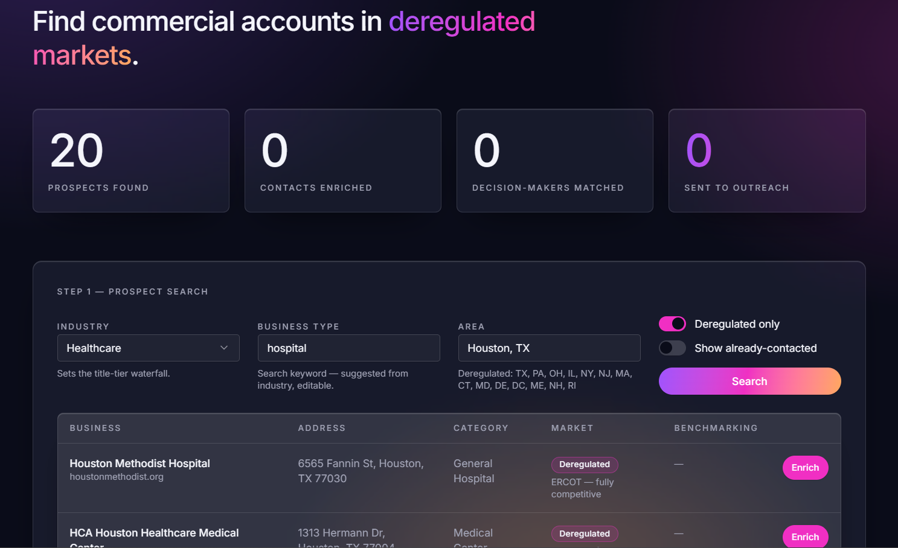
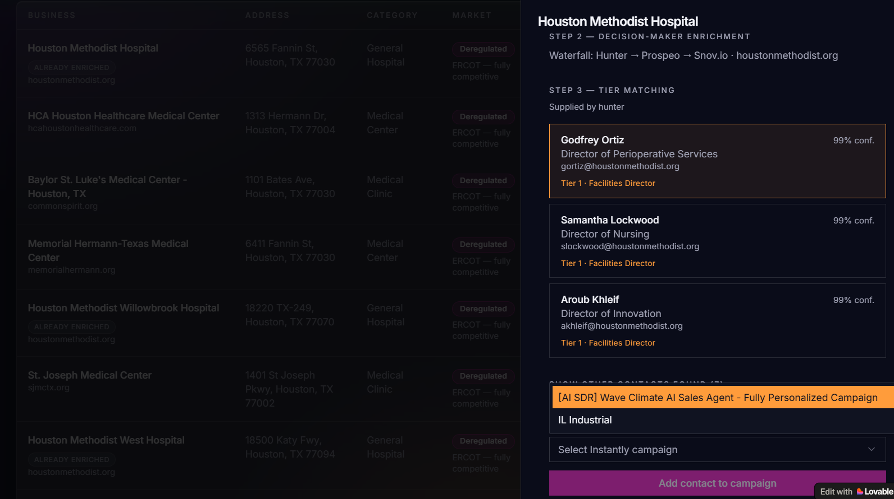
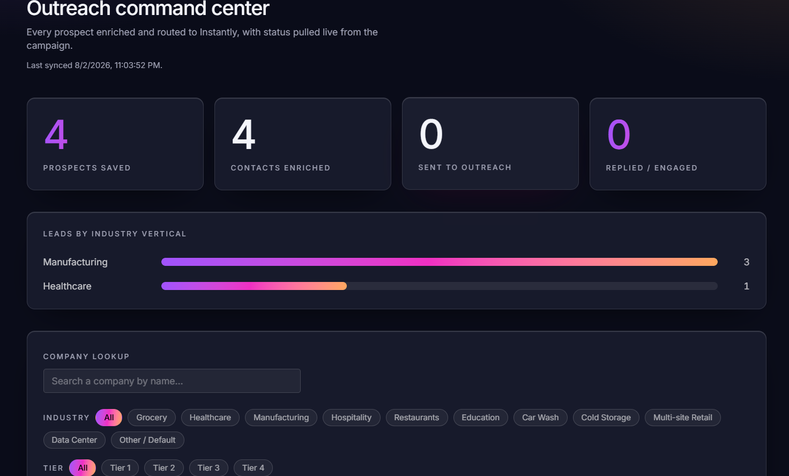
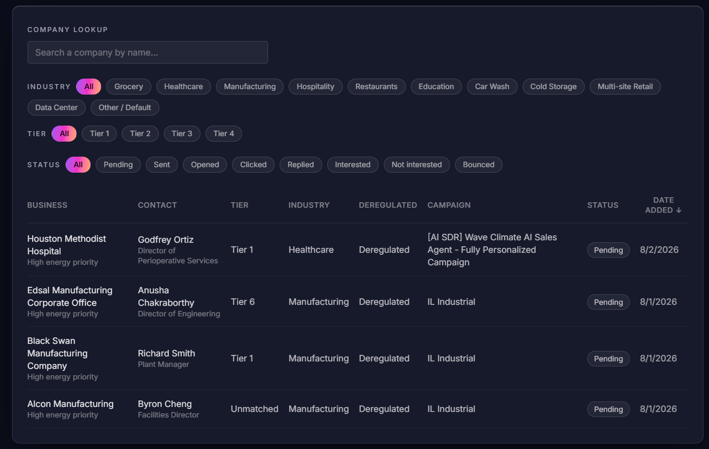
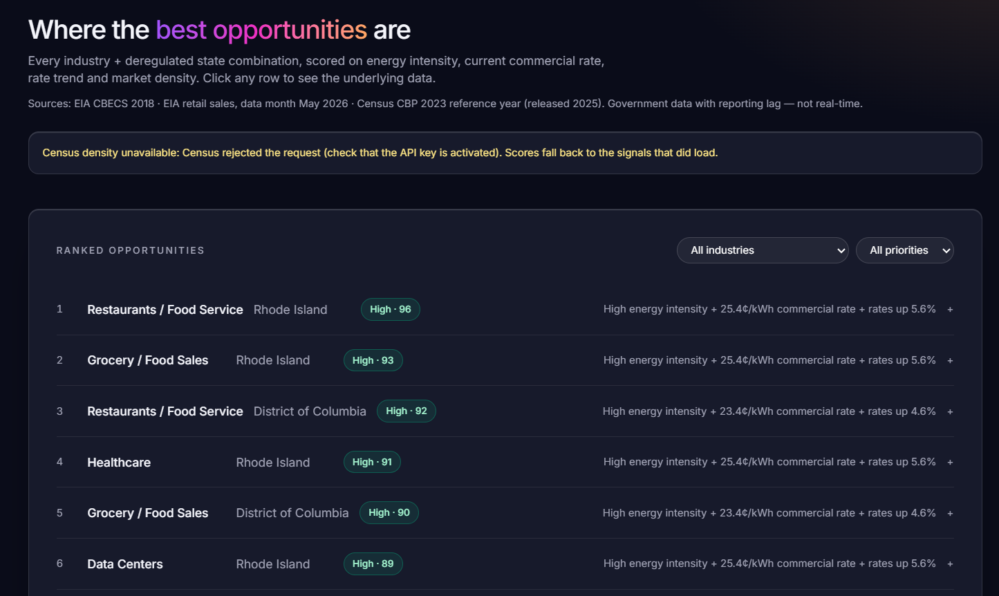
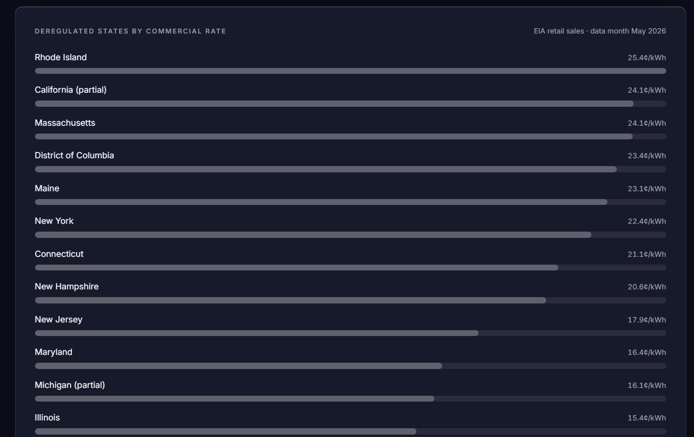
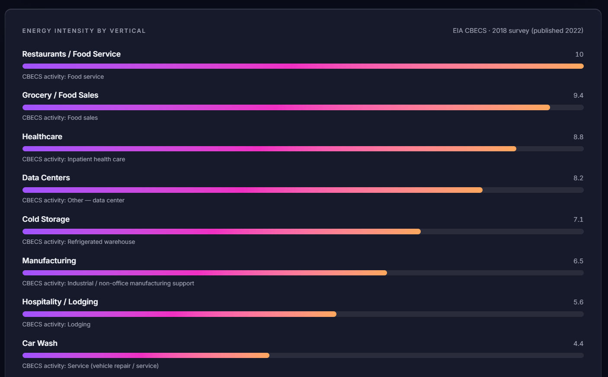

# WaveLead Navigator

A B2B lead generation and prospecting tool built for WaveClimate, a commercial energy advisory firm operating in deregulated electricity markets. WaveLead Navigator finds commercial prospects, identifies the right decision-maker at each company, and routes them into automated outreach — combining public energy-market data with a multi-provider contact enrichment waterfall.

**🔗 Live site:** [wavelead-navigator.lovable.app](https://wavelead-navigator.lovable.app/)

> **Status: actively under development.** This is a working, live tool connected to real third-party APIs (Google Places, Hunter, Prospeo, Snov.io, Instantly) — features are still being added and refined. What's live reflects a real, functioning pipeline, not a static demo.

---

## What it does

1. **Prospect Search** — searches commercial businesses by industry and location using the Google Places API, cross-referenced against a deregulated electricity market lookup table
2. **Decision-Maker Enrichment** — runs a modular waterfall across Hunter, Prospeo, and Snov.io to find real contacts at each company, with cached results to avoid re-spending credits on repeat searches
3. **Tier Matching** — matches enriched contacts against industry-specific title hierarchies (10 verticals, each with its own ranked decision-maker path) to automatically surface the best point of contact
4. **Outreach Routing** — sends the matched contact directly into an Instantly email campaign with one click
5. **Outreach Command Center** — a persistent, live-synced record of every prospect found, enriched, and contacted, with status automatically pulled from Instantly, filterable by industry, tier, and status
6. **Market Intelligence** — a ranked leaderboard of every industry + deregulated-state combination, scored on energy intensity (EIA CBECS), current commercial electricity rates (EIA retail sales), rate trend, and market density (U.S. Census County Business Patterns) — surfacing exactly where the best opportunities are, backed by real public data rather than guesswork

## Why I built this

My background is in enterprise telecom procurement — managing supplier relationships, contract lifecycles, and complex multi-party negotiations. I built WaveLead Navigator to demonstrate that the same skillset applies directly to clean energy procurement: both involve navigating supplier complexity, structured decision-making, and long-term contracts in regulated, technical markets. Rather than relying on off-the-shelf sales tools, I built this pipeline from scratch to show hands-on ability with API integration, data enrichment architecture, and AI-assisted app development — real infrastructure solving a real problem in my own business, not just a portfolio exercise.

## Tech stack

- **Frontend/Backend:** Built in Lovable (React + Supabase)
- **Development process:** Architected and built in collaboration with Claude (Anthropic) — used for research, prompt engineering, data pipeline design, and debugging throughout the build
- **APIs:** Google Places API (New), Hunter.io, Prospeo, Snov.io, Instantly, EIA Open Data API (retail rates + STEO forecasts), U.S. Census Bureau API (County Business Patterns)
- **Static reference data:** EIA CBECS 2018 energy intensity survey
- **Version control:** GitHub, synced directly from Lovable

## Screenshots

### Prospect Search

### Decision-Maker Enrichment & Tier Matching

### Outreach Command Center

### Market Intelligence

## Key features worth highlighting

- Modular waterfall enrichment architecture — providers can be added or swapped without rebuilding core logic
- Industry-specific decision-maker tier matching, with a corporate-title exclusion guardrail (deprioritizes titles like "Global VP" in favor of facility-specific contacts)
- Enrichment result caching to avoid re-spending API credits on repeat searches
- Live-synced outreach status pulled directly from Instantly's API
- Market Intelligence scoring engine combining four independent public data sources (EIA CBECS, EIA retail rates, EIA STEO forecasts, U.S. Census County Business Patterns) into a single ranked opportunity score per industry + state

---

*Built as part of a portfolio demonstrating AI-assisted app development and data pipeline design for clean energy sales and partnerships roles.*
